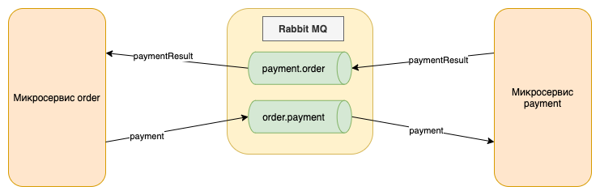
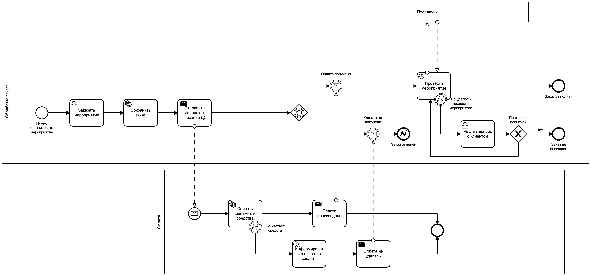

# Spring Boot Camunda (Rabbit MQ Event Bus)
Пример межпроцессного (межсервисного) взаимодействия с использованием шины событий (на базе Rabbit MQ)

- В демонстрационных целях оба микросервиса "упакованы" в общее приложение Camunda Spring Boot (компоненты размещены в 
соответствующих пакетах ms.order, ms.payment)
- Процесс = Сервис
- Routing key = Queue
- Процесс "Обработка заказа" стартует через TaskList ("ключом", связующим процессы между собой, 
является строковое значение orderId, вводимое в стартовой форме)
- Сервис "Обработка заказа" направляет сообщение Payment в сервис Payment
- Если сумма заказа >= 50000, вырабатывается ошибка "недостаточно средств", иначе "списание"
является успешным
- Результат обработки платежа возвращается в сервис "Обработка заказа"
- Требуется реализация внешнего обработчика для задачи  "Провести мероприятие"

# Архитектура приложения

# Диаграмма взаимодействия (BPMN 2.0)

